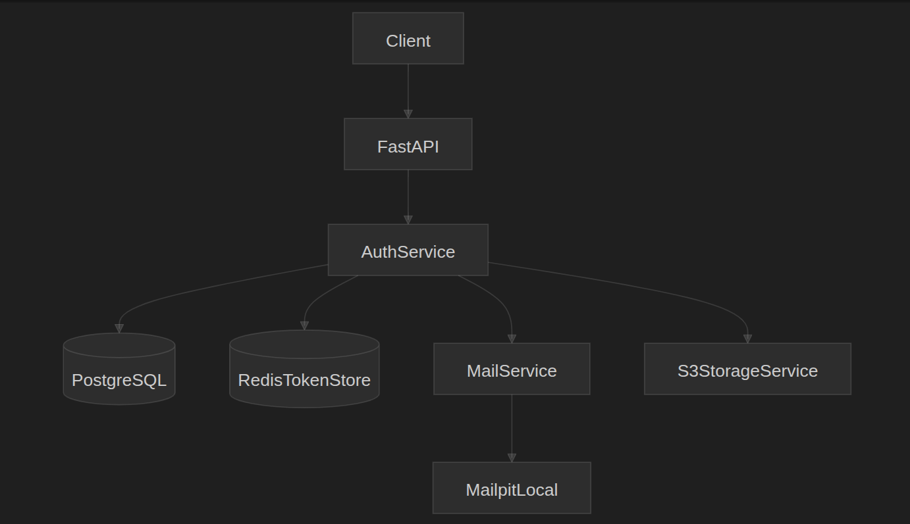

# FastAPI Auth Template

Reusable backend template for end-to-end user authentication, RBAC, and file storage. Use it as a base for any project that needs signup, email verification, login/logout, password reset, OTP login, and S3-compatible file uploads (MinIO locally, AWS S3 in production).

---

## Core Architecture

The diagram below shows how the API, database, cache, mail, and storage pieces fit together.



**Flow summary:**

- **Clients** call the FastAPI app (auth and user endpoints).
- **Auth endpoints** use `AuthService` for signup, login, logout, OTP, and token verification; they use `EmailService` for verification and password-reset emails.
- **User endpoints** use `RBACService` for permission checks and `StorageService` for profile-picture uploads.
- **PostgreSQL** stores users, groups, permissions, tokens, and file metadata.
- **Redis** stores session revocation data so logout invalidates refresh tokens.
- **Mailpit** (or any SMTP) sends verification and password-reset emails locally.
- **S3 or MinIO** stores uploaded files (MinIO for local testing, AWS S3 for production).

---

## Functionality and Use Cases

| Area | What it does | Use case |
| ---- | ------------ | -------- |
| **Signup** | Create user (inactive), send verification email | New user registration |
| **Verify email** | Activate account with one-time token | Confirm email ownership |
| **Login** | Email + password → JWT access + refresh tokens | Standard login |
| **Logout** | Revoke refresh token in Redis + DB | Secure sign-out |
| **Forgot password** | Send reset link/token by email | User forgot password |
| **Reset password** | Set new password with token | Complete password reset |
| **Request OTP** | Send one-time code to email | Passwordless login prep |
| **Login with OTP** | Email + OTP → JWT pair | Passwordless login |
| **Verify token** | Validate access token, return claims | Check if token is valid |
| **Users, groups, permissions** | Group-based RBAC | Restrict access by permission code |
| **Profile picture** | Upload image to S3/MinIO, save URL in user | Avatar and file storage |
| **Migrations** | Alembic revisions, generate and apply | Schema changes over time |

---

## Tech Stack

| Component | Technology |
| --------- | ---------- |
| API | FastAPI |
| Database | PostgreSQL (async via SQLAlchemy + asyncpg) |
| Migrations | Alembic |
| Cache / sessions | Redis |
| Auth | JWT (access + refresh), Argon2 passwords |
| Validation | Pydantic |
| Mail (local) | Mailpit |
| File storage | AWS S3 or MinIO (S3-compatible) |
| Containers | Docker, Docker Compose |

---

## How to Run the Application

### Prerequisites

- Python 3.11+
- Docker and Docker Compose (for containerized run)
- Optional: PostgreSQL, Redis, Mailpit, MinIO running locally for non-Docker run

### 1. Environment setup

Copy the example env and adjust if needed:

```bash
cp .env.example .env
```

Edit `.env` for your environment (e.g. `SECRET_KEY`, DB credentials, `AWS_S3_*` or MinIO).

### 2. Start (Docker Compose — recommended)

**Start core stack (API + Postgres + Redis + Mailpit):**

```bash
docker compose up --build
```

**Start with MinIO for local file storage:**

```bash
docker compose --profile local-s3 up --build
```

Or start only the services you need:

```bash
docker compose up --build api postgres redis mailpit
# With MinIO:
docker compose --profile local-s3 up --build api postgres redis mailpit minio
```

**Apply migrations before first use (if not already applied):**

```bash
docker compose run --rm migration-apply
```

**URLs (default ports from `.env`):**

- API: `http://localhost:8000`
- API docs: `http://localhost:8000/docs`
- Health: `http://localhost:8000/healthz`
- Mailpit UI: `http://localhost:8025` (inspect outgoing emails)

### 3. Stop the application

**Stop all services (containers removed):**

```bash
docker compose down
```

**Stop and remove volumes (fresh DB):**

```bash
docker compose down -v
```

**Stop in background (no logs):**

```bash
docker compose up -d
# later:
docker compose stop
```

### 4. Run locally (without Docker)

Use when you want to run the API on the host and point it to local or existing Postgres/Redis/Mailpit.

1. Install dependencies:

   ```bash
   pip3 install -e .
   ```

2. Ensure PostgreSQL and Redis are running and `.env` points to them (e.g. `POSTGRES_SERVER=localhost`, `REDIS_URL=redis://localhost:6379/0`).

3. Run migrations:

   ```bash
   alembic upgrade head
   ```

4. Start the API:

   ```bash
   uvicorn app.main:app --reload
   ```

   API: `http://localhost:8000`, docs: `http://localhost:8000/docs`.

---

## Migrations (Alembic)

Migrations are used to create and update the database schema. All config comes from `.env` (via `app.core.config`).

### Using Docker Compose

**Apply latest migrations:**

```bash
docker compose run --rm migration-apply
```

**Generate a new migration from model changes:**

```bash
MIGRATION_MESSAGE=describe_your_change docker compose run --rm migration-generate
```

Then review the new file under `alembic/versions/` and apply:

```bash
docker compose run --rm migration-apply
```

### Using local Alembic

**Apply:**

```bash
alembic upgrade head
```

**Generate:**

```bash
alembic revision --autogenerate -m "describe_your_change"
```

**Roll back one revision:**

```bash
alembic downgrade -1
```

---

## Testing

**Install dev dependencies and run tests:**

```bash
pip3 install -e ".[dev]"
pytest -q
```

Tests cover signup → verify email → login → logout, forgot/reset password, and OTP request/login flows (with faked email and in-memory DB/Redis where applicable).

---

## API Endpoints

| Method | Path | Description |
| ------ | ---- | ----------- |
| GET | `/healthz` | Health check |
| POST | `/api/v1/auth/signup` | Register; sends verification email |
| POST | `/api/v1/auth/verify-email` | Activate account with token |
| POST | `/api/v1/auth/login` | Login; returns access + refresh tokens |
| POST | `/api/v1/auth/logout` | Revoke refresh token |
| POST | `/api/v1/auth/forgot-password` | Send password-reset email |
| POST | `/api/v1/auth/reset-password` | Set new password with token |
| POST | `/api/v1/auth/request-otp` | Send OTP to email |
| POST | `/api/v1/auth/login-otp` | Login with email + OTP |
| GET | `/api/v1/auth/verify-token` | Validate access token (Bearer) |
| GET | `/api/v1/users/me` | Current user profile (Bearer) |
| GET | `/api/v1/users/me/permissions` | Current user permissions (Bearer) |
| POST | `/api/v1/users/me/profile-picture` | Upload profile picture (Bearer) |

Use **Bearer &lt;access_token&gt;** in the `Authorization` header for protected routes.

---

## MinIO for Local File Storage

For local testing, the template uses **MinIO** as an S3-compatible store. `.env.example` (and the project `.env`) are set up for it:

- `AWS_S3_ENDPOINT_URL=http://minio:9000` (use `http://localhost:9000` if MinIO runs on host)
- `AWS_ACCESS_KEY_ID=minioadmin`
- `AWS_SECRET_ACCESS_KEY=minioadmin`
- `AWS_S3_BUCKET=app-local-bucket`

Start MinIO with the stack:

```bash
docker compose --profile local-s3 up api postgres redis mailpit minio
```

Profile pictures and other uploads are stored in the bucket; stored URLs use the MinIO endpoint (e.g. `http://minio:9000/app-local-bucket/...`). For production, point `AWS_*` to real AWS S3 and leave `AWS_S3_ENDPOINT_URL` unset.

---

## Summary

- **Core architecture**: FastAPI app → Auth/RBAC/Email/Storage services → PostgreSQL, Redis, Mailpit, S3/MinIO (see diagram above).
- **Functionality**: Full auth lifecycle (signup, verify, login, logout, forgot/reset, OTP), token verification, RBAC, and profile-picture upload to S3/MinIO.
- **Start**: `docker compose up --build` (optionally with `--profile local-s3` for MinIO); run `migration-apply` once if needed.
- **Stop**: `docker compose down` (or `down -v` to reset volumes).
- **Run locally**: `pip3 install -e .`, `alembic upgrade head`, `uvicorn app.main:app --reload`.
